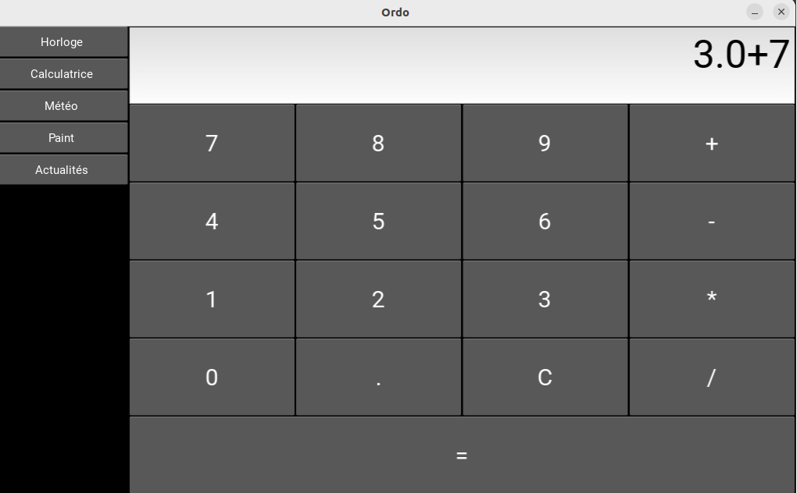

# Ordo_calculator

Application Ordo permettant d'utiliser une calculatrice



## Ajouter l'application

Sur Ordo, déposer ce dossier dans "plugins" dans votre application Ordo.

Puis, sur parameters/ordo.json, ajouter Ordo_calculator de cette manière : 

```
{
    "plugins" : ["ordo_calculator"]
}
```